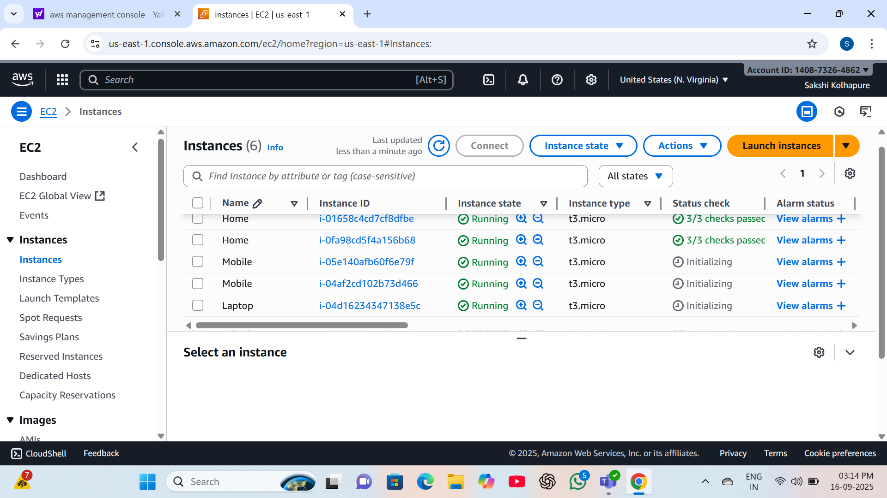
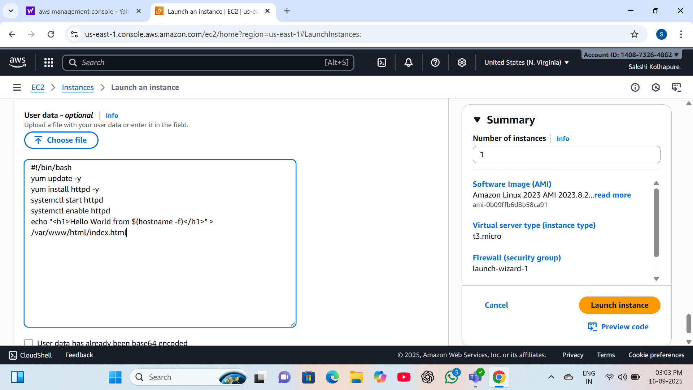
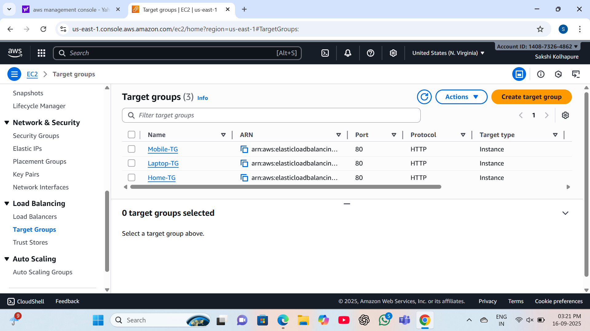
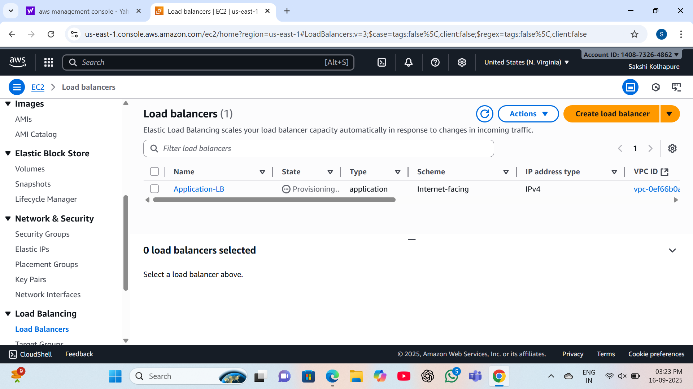
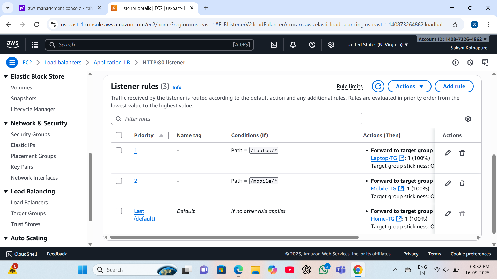
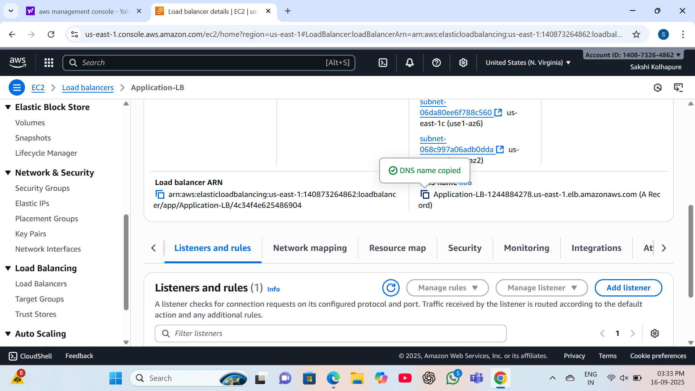
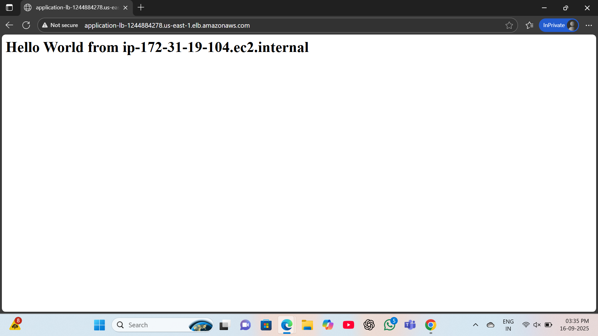

# Application-Load-Balancer-ALB-
ALB readme.md 2025-09-16

> Application Load Balancer (ALB) Project
>
> Introduction:
>
> This project shows how to run multiple Ec2 instances using
> **Application** **Load** **Balancer** . The goal of this project is to
> demostrate ALB setup, creating target groups and add listener rule.
>
> Step1- Launch 6 EC2 instances(Home-2, Laptop-2, Mobile-2) with
> indivisual user scripts.
>
> 1 / 4

ALB readme.md 2025-09-16

> Step2- Create target groups and register the instances.
>
> Step3- Create an Application Load Balancer.
>
> Step4- Configure the listeners rule.
>
> 2 / 4

ALB readme.md 2025-09-16

> Step5- Copy the DNS Name of ALB.
>
> Step6- Test by hitting the ALB DNS name.
>
> 3 / 4

ALB readme.md 2025-09-16

> Summary:
>
> This project shows how to run application with Load Balancer. It
> covers how to launch an EC2 instance, create ALB, create Target
> Groups, configure listner rules.
>
> 4 / 4
